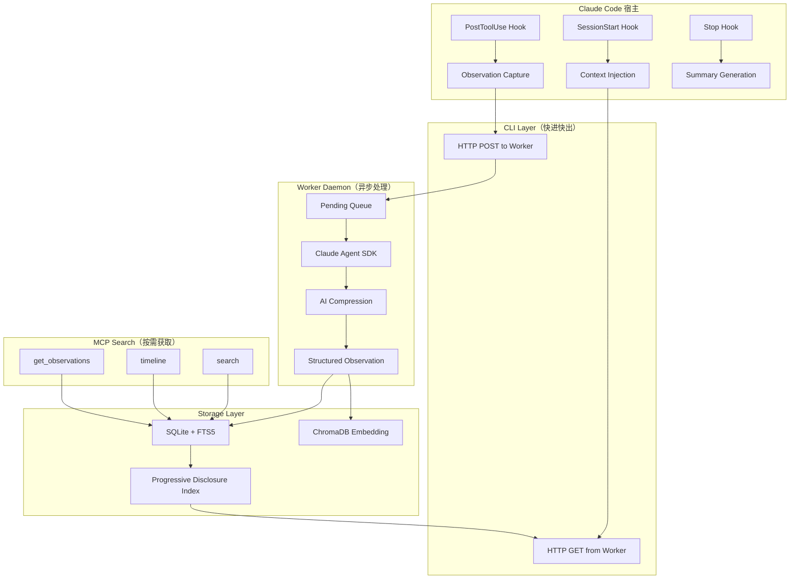

> **配套资源**  
> 源码仓库 · [github.com/diguike/book-claude-mem](https://github.com/diguike/book-claude-mem)  
> 在线阅读 · [inferloop.dev/claude-mem](https://inferloop.dev/claude-mem)

## 为什么写这本书

2025 年下半年，Agent 开发从"能跑通 Demo"进入了"能上生产"的阶段。越来越多工程师开始构建真正有用的 AI Agent，很快撞上同一堵墙：Agent 没有记忆。

每次新会话开始，Agent 对项目一无所知。上一轮花 20 分钟定位的 Bug 根因、做出的架构决策、踩过的坑——全部丢失。工程师不得不反复交代背景，Agent 不得不反复探索已知的代码。它直接决定了 Agent 的实际生产力上限。

我第一次注意到 claude-mem 时，它已经在 GitHub 上积累了超过 10,000 stars——一个 Claude Code 的记忆插件能做到这个量级，说明痛点确实普遍。但真正让我产生写书冲动的不是 star 数，而是读完源码后的感受：它不是一个"把东西存起来再找出来"的 CRUD 应用，而是在解决一个更深层的问题——如何在有限的上下文窗口里，以最高效率向 Agent 提供它真正需要的信息。

claude-mem 的 Progressive Disclosure（渐进式信息披露）设计、基于 Hook 的非侵入式架构、3 层搜索工作流，这些设计背后是对 LLM 注意力机制的深刻理解，对任何做 Agent 开发的工程师都有直接价值——不管你用不用 claude-mem 本身。

## 什么是 Claude Code

Claude Code 是 Anthropic 官方的命令行 AI 编程工具，直接运行在 shell 中，能读写文件、执行命令、搜索代码。claude-mem 是为它量身设计的记忆插件，借助 Plugin 系统（Hook + MCP 协议）在后台工作，不改变正常使用方式。

## 这本书给谁看

- **前端/全栈工程师**，熟悉 TypeScript + Node.js，想进入 Agent 开发领域
- **已经在做 Agent 开发的人**，想系统理解 Memory 这一层该怎么设计
- **技术负责人**，在评估或规划企业级 Agent Memory 平台

不需要机器学习背景。需要的是：能看懂 TypeScript 代码、理解 HTTP API 设计、用过 SQLite 或类似数据库。

两类读者不适合这本书：完全没写过 TypeScript/Node.js 的读者，书中大量源码分析会读得吃力，建议先补语言基础；只想找一个开箱即用的记忆 SaaS、不关心内部实现的读者，直接看第 15 章的方案对比就够了，不必读全书。

## 这本书不是什么

首先，它不是 claude-mem 用户手册的翻译。本书基于 v12.6.2，API 细节可能随版本变化，书的重心是稳定的架构设计与设计哲学。其次，第 15-18 章的企业篇是设计参考与架构推演，给出的是升级路径和取舍分析，不是可以直接生产部署的代码。

## 这本书怎么读

全书分五个部分：

**第一部分（认知篇）** 建立心智模型：Agent Memory 的问题域、claude-mem 快速上手、Context Engineering 基础。

**第二部分（架构篇）** 深入源码，逐层拆解系统设计：Hook → Worker → Storage。想理解"生产级 Memory 系统长什么样"，这四章是核心。

**第三部分（机制篇）** 聚焦创新点：Progressive Disclosure、MCP 搜索、Observation 压缩——claude-mem 区别于简单 RAG 的关键设计。

**第四部分（实战篇）** 动手构建 mini-mem，做完你会拥有一个能在 Claude Code 里实际使用的 Memory Plugin。

**第五部分（进阶篇）** 面向产品化：业界方案调研 + 平台架构升级路径。

每章都有配套的可执行代码（`examples/` 目录，TypeScript，可独立运行），也可以直接跳到感兴趣的章节，配合代码上手。

**推荐阅读路线**：

- **"我想快速上手"**：第 2 章 → 第 12 章 → 第 13 章
- **"我想理解设计思想"**：第 1-3 章 → 第 8 章（Progressive Disclosure）
- **"我想深入源码"**：第 4-7 章 → 第 9-11 章
- **"我想做产品/平台"**：前面基础上 + 第 15-17 章

## 全书知识图谱

核心链路：**Observe（Hook 捕获）→ Compress（AI 压缩）→ Store（SQLite+向量）→ Inject（Progressive Disclosure 索引注入）→ Search（MCP 按需获取）**

## 社区与勘误

本书在 [inferloop.dev](https://inferloop.dev) 开源发布，勘误反馈和 mini-mem 扩展分享请到社区提交。内容以 CC BY-NC-SA 4.0 协议发布，代码示例以 MIT 协议发布；商业转载请联系作者，个人转载请注明出处。

## 致谢

感谢 Alex Newman 和 claude-mem 社区创建并维护了这个优秀的开源项目（AGPL-3.0），为这个领域提供了生产级的参考实现。

---

> 本章来自《Agent Memory 工程实战》开源版 · 作者「递归客」  
> 在线阅读完整书系：[inferloop.dev](https://inferloop.dev)  
> 源码仓库：[github.com/diguike/book-claude-mem](https://github.com/diguike/book-claude-mem)
