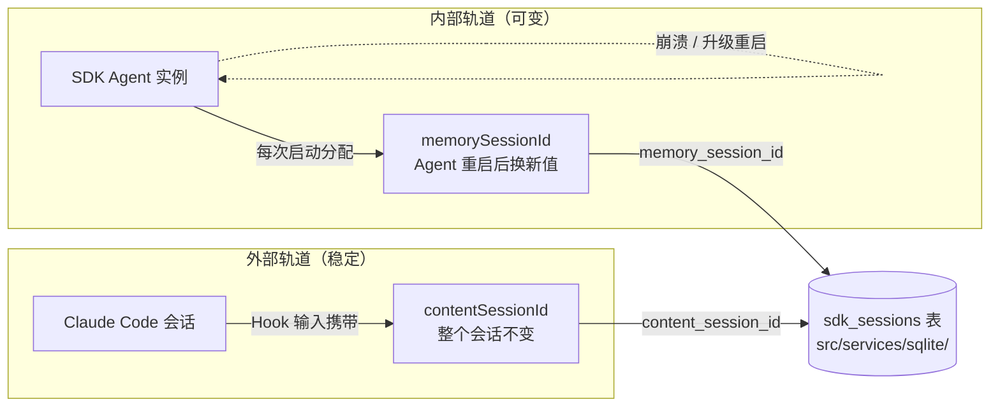
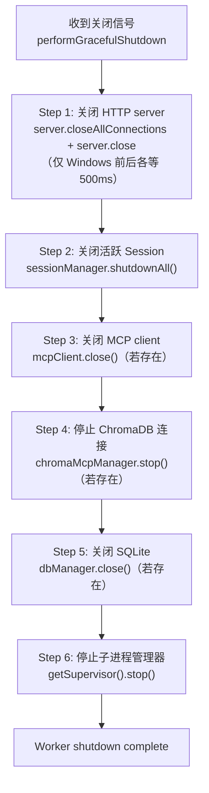

## 为什么需要后台 Worker

Hook 的性能要求（p95 < 50ms）和 AI 压缩的实际耗时（5-30 秒）之间存在两个数量级的差距。这决定了 claude-mem 必须采用异步架构：

```
Hook（同步，必须快）          Worker（异步，可以慢）
┌──────────────────┐         ┌──────────────────────────┐
│ 读 stdin         │  HTTP   │ 接收观察数据              │
│ POST 到 Worker   │────────→│ 入队 pending_messages     │
│ 返回 success     │         │ 取出队列逐条处理          │
│ 耗时 < 30ms      │         │ 调用 Claude SDK 压缩      │
└──────────────────┘         │ 存入 observations 表      │
                             │ 同步 ChromaDB embedding   │
                             │ 耗时 5-30s / 条           │
                             └──────────────────────────┘
```

Worker 是一个常驻的 HTTP 服务进程，由 Bun 管理生命周期。它在第一次 SessionStart Hook 触发时自动启动，之后保持运行直到被显式停止或系统关机。

## Express HTTP API 设计

Worker 使用 Express.js 作为 HTTP 框架，监听在用户专属端口上：

```typescript
// src/services/worker-service.ts（简化）
// 端口计算：37700 + (uid % 100)
const port = getWorkerPort(); // 默认 37700

const server = new Server(app);
// 注册路由组
server.registerRoutes(new SessionRoutes(sessionManager, dbManager));
server.registerRoutes(new SearchRoutes(searchManager));
server.registerRoutes(new DataRoutes(dbManager));
server.registerRoutes(new ViewerRoutes());
```

核心 API 端点：

| 端点 | 方法 | 调用者 | 用途 |
|------|------|--------|------|
| `/api/sessions/init` | POST | session-init Hook | 注册新会话 |
| `/api/sessions/observations` | POST | observation Hook | 提交工具观察 |
| `/api/sessions/summarize` | POST | summarize Hook | 请求生成摘要 |
| `/api/sessions/complete` | POST | session-end | 标记会话完成 |
| `/api/context/inject` | GET | context Hook | 获取注入的上下文 |
| `/api/context/semantic` | GET | session-init Hook | 语义相关上下文 |
| `/api/search` | GET | MCP Server | 全文搜索 |
| `/api/timeline` | GET | MCP Server | 时间线查询 |
| `/api/observations/batch` | POST | MCP Server | 批量获取 Observation |
| `/health` | GET | 健康检查 | Worker 状态 |

设计原则：
- Hook 调用的端点（/api/sessions/*）只做入队操作，立即返回
- MCP 调用的端点（/api/search、/api/timeline）执行实际查询
- 所有端点都有超时保护和错误处理

## Pending Queue 机制

当 observation Hook 提交数据到 Worker 时，数据不会立即被处理，而是进入一个持久化队列：

```typescript
// 简化的入队逻辑
// Worker 接收 POST /api/sessions/observations
async handleObservation(req, res) {
  const { contentSessionId, tool_name, tool_input, tool_response } = req.body;

  // 找到对应的数据库 session
  const session = this.dbManager.findSessionByContentId(contentSessionId);

  // 入队（写入 SQLite pending_messages 表）
  this.pendingStore.enqueue(session.id, {
    type: 'observation',
    tool_name,
    tool_input,
    tool_response,
  });

  // 立即返回（不等待处理完成）
  res.json({ status: 'queued' });
}
```

队列的生命周期：

```
enqueue() → INSERT INTO pending_messages (status='pending')
    ↓
Worker 取出 → UPDATE status='processing'
    ↓
AI 压缩完成 → Parser 解析成功 → clearPendingForSession()
    ↓
如果解析失败 → 保留在队列中，等待下次尝试
```

关键设计：`clearPendingForSession()` 在 Parser 返回有效结果时清除**该 session 所有 pending 记录**，而非逐条清除。这简化了去重逻辑——AI 一次处理可能覆盖队列中的多条原始观察。

## SDK Agent 的 Generator 模式与重启策略

Worker 内部使用 Claude Agent SDK 进行 AI 压缩。每个活跃 Session 对应一个 SDK Agent 实例，以 Generator（异步迭代器）模式运行：

```typescript
// 简化的 Generator 循环
async function* processSession(session: ActiveSession) {
  while (true) {
    // 等待新的 pending messages
    const messages = await waitForPending(session.id);
    if (!messages.length) break; // session 结束

    // 构造 prompt，发送给 Claude SDK
    const prompt = buildCompressionPrompt(messages);
    const response = await claudeAgent.send(prompt);

    // 解析 AI 返回的结构化 Observation
    const parsed = parseResponse(response);
    if (parsed.valid) {
      yield parsed.observations; // 产出结构化 Observation
      clearPending(session.id);
    }
    // 无效响应：不清除队列，下次重试
  }
}
```

**重启策略**：Generator 可能因为 API 错误、网络超时等原因崩溃。claude-mem 实现了指数退避重启：

```
Generator 崩溃 → 等 1s → 重试 1
                → 等 2s → 重试 2
                → 等 4s → 重试 3
                → consecutiveRestarts > 3 → 放弃，让 Generator 自然结束
```

计数器在 Generator 成功完成一次工作后重置为 0。这防止了"死循环重启"消耗资源，同时允许从临时故障中恢复。

## Session ID 双轨制

claude-mem 维护两种 Session ID，这是理解其内部逻辑的关键：

| ID 类型 | 来源 | 生命周期 | 用途 |
|---------|------|---------|------|
| `contentSessionId` | Claude Code 分配 | 整个用户会话不变 | 关联 Hook 输入和数据库记录 |
| `memorySessionId` | SDK Agent 分配 | Worker 每次重启时变化 | AI 压缩 Agent 的内部标识 |

为什么需要两个 ID？

Claude Code 分配的 `contentSessionId` 在整个会话期间不变，是外部身份标识。但 Worker 的 SDK Agent 可能重启（升级、崩溃恢复），每次重启都会获得新的 `memorySessionId`。

数据库中 `sdk_sessions` 表同时存储两个 ID，通过 `content_session_id` 关联外部会话，通过 `memory_session_id` 关联 AI Agent 的内部状态。两条轨道的来源、变化时机和汇合点如图 6-1 所示：



图 6-1：Session ID 双轨制——contentSessionId 与 memorySessionId 的来源与汇合

```sql
-- sdk_sessions 表
CREATE TABLE sdk_sessions (
  id INTEGER PRIMARY KEY,
  content_session_id TEXT NOT NULL,  -- 来自 Claude Code
  memory_session_id TEXT,            -- 来自 SDK Agent（可能变化）
  project TEXT,
  status TEXT DEFAULT 'active',
  created_at_epoch INTEGER
);
```

## 进程管理

### PID 文件

Worker 启动时在 `~/.claude-mem/worker.pid` 写入进程 ID。后续操作通过读取 PID 文件判断 Worker 是否存活：

```typescript
// 简化逻辑
async function ensureWorkerStarted(): Promise<void> {
  const pid = readPidFile();
  if (pid && isProcessAlive(pid)) {
    return; // Worker 已在运行
  }
  // 清理 stale PID file
  if (pid) removePidFile();
  // 启动新 Worker
  spawnDaemon();
  await waitForHealth(); // 等待 /health 端点可用
}
```

### 健康检查

Worker 暴露 `/health` 端点，返回当前状态：

```json
{
  "status": "healthy",
  "version": "12.6.2",
  "uptime": 3600,
  "sessions": { "active": 2, "total": 15 },
  "observations": { "total": 342, "pending": 3 }
}
```

Hook 在启动 Worker 后会调用 `waitForHealth()`，轮询 `/health` 直到返回 200 或超时。

### Orphan Reaper

每 5 分钟执行一次的清理任务，杀掉没有关联活跃 Session 的 SDK 子进程：

```typescript
// 每 5 分钟执行
function reapOrphans() {
  for (const [pid, process] of processRegistry) {
    if (!hasActiveSession(process.sessionId)) {
      kill(pid);
      processRegistry.delete(pid);
    }
  }
}
```

防止因异常退出导致的僵尸进程累积。

## Graceful Shutdown：六步顺序关闭

当 Worker 需要关闭时（手动停止、SIGTERM），`performGracefulShutdown()` 按固定顺序依次 await 六个步骤。这个函数位于 `src/services/infrastructure/GracefulShutdown.ts`，全文件只有 75 行：

```typescript
// src/services/infrastructure/GracefulShutdown.ts（简化）
export async function performGracefulShutdown(config: GracefulShutdownConfig): Promise<void> {
  // Step 1: 关闭 HTTP server（强制断开现有连接 + 停止监听）
  if (config.server) {
    await closeHttpServer(config.server);
  }

  // Step 2: 关闭所有活跃 Session（及其 SDK Agent）
  await config.sessionManager.shutdownAll();

  // Step 3: 关闭 MCP client（若存在）
  if (config.mcpClient) {
    await config.mcpClient.close();
  }

  // Step 4: 停止 ChromaDB 的 MCP 连接（若存在）
  if (config.chromaMcpManager) {
    await config.chromaMcpManager.stop();
  }

  // Step 5: 关闭 SQLite 数据库（若存在）
  if (config.dbManager) {
    await config.dbManager.close();
  }

  // Step 6: 停止子进程 supervisor
  await getSupervisor().stop();
}
```

第一步的 `closeHttpServer()` 内部做了两件事：先调用 `server.closeAllConnections()` 强制断开所有现存连接，再调用 `server.close()` 停止监听。唯一的平台特判是 Windows——在这两个调用前后各等待 500ms，给操作系统留出端口清理的时间；其他平台没有任何等待。

整个流程如图 6-2 所示：



图 6-2：Worker 优雅关闭的六步顺序流程（src/services/infrastructure/GracefulShutdown.ts）

关闭顺序的设计逻辑是"从外到内"：先切断入口（HTTP server），保证不再有新请求进来；然后关业务层（Session 和 SDK Agent），让正在进行的 AI 压缩收尾；再断开外部连接（MCP client、ChromaDB）；最后才关存储（SQLite）和子进程管理器。如果顺序反过来——比如先关数据库——尚未结束的 Session 在收尾时的写入就会直接失败。粗暴的 `process.exit()` 之所以危险，也是同一个原因：正在写入的 SQLite 事务可能损坏，ChromaDB 同步会中断，SDK 子进程会变成孤儿。

另外两点和直觉可能不同，读源码时值得对照确认：

- **没有超时兜底**。每一步都是直接 `await`，任何一步挂起，整个关闭流程就卡在那里，不会跳到下一步，最终只能靠外层的强制杀进程收场。
- **没有 PID 文件清理步骤**。关闭流程不负责删除 `~/.claude-mem/worker.pid`，stale PID 文件由下次启动时的检测逻辑处理（见前文"PID 文件"一节）。

---

**思考题**

1. Worker 单实例能支持多少并发 session？瓶颈在 CPU（AI 压缩）、内存（队列堆积）还是 I/O（SQLite 写入）？设计一个压测方案来验证。
2. 如果 Worker 进程意外崩溃，队列中未处理的消息会丢失吗？如何设计一个"崩溃恢复"机制？
3. 当前的 graceful shutdown 流程是串行的（六步依次 await），且没有任何超时兜底。如果某一步卡住，后续步骤都无法执行——如何改进？

---

> 本书开源发布于 [inferloop.dev](https://inferloop.dev)，转载请注明出处。

下一章将深入存储层设计：SQLite Schema、FTS5 全文搜索、ChromaDB 向量同步的具体实现。

---

> 本章来自《Agent Memory 工程实战》开源版 · 作者「递归客」  
> 在线阅读完整书系：[inferloop.dev](https://inferloop.dev)  
> 源码仓库：[github.com/diguike/book-claude-mem](https://github.com/diguike/book-claude-mem)
