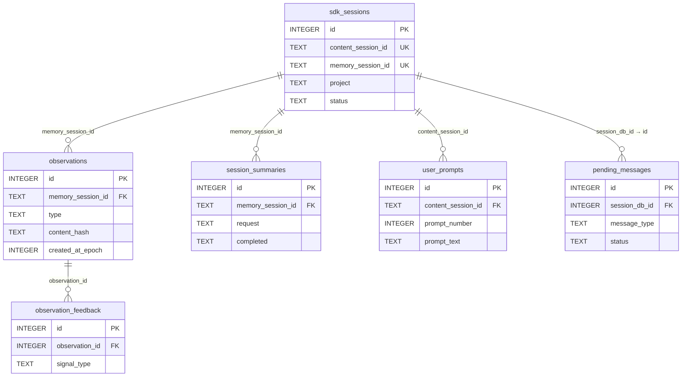

## SQLite 数据模型：6 张核心表

claude-mem 的持久化存储使用 SQLite，通过 Bun 原生的 `bun:sqlite` 驱动访问。数据库文件位于 `~/.claude-mem/claude-mem.db`。

初始化时设置了一系列 PRAGMA（SQLite 的运行时配置指令，类似于数据库的 "设置项"）：

```typescript
// src/services/sqlite/Database.ts
this.db.run('PRAGMA journal_mode = WAL');       // WAL 模式：读写互不阻塞（类似 optimistic locking）
this.db.run('PRAGMA synchronous = NORMAL');      // 不要每次写都等磁盘确认，换取性能
this.db.run('PRAGMA foreign_keys = ON');         // 开启外键约束
this.db.run('PRAGMA temp_store = memory');       // 临时计算在内存中完成
this.db.run('PRAGMA mmap_size = 268435456');     // 用 256MB 内存映射文件，加速读取
this.db.run('PRAGMA cache_size = 10000');        // 缓存 10000 个数据页
```

如果你之前只用过 Prisma 或 TypeORM，直接写 SQL 和 PRAGMA 可能感觉 "底层"。但 SQLite 的优势正在于：它不需要安装服务、不需要连接字符串，就是一个文件。PRAGMA 只需要设置一次，之后的 CRUD 操作和 ORM 里写的没有本质区别。

6 张核心表及其关系：

```sql
-- 会话表：每次 Claude Code 会话的生命周期
CREATE TABLE sdk_sessions (
  id INTEGER PRIMARY KEY,
  content_session_id TEXT NOT NULL,    -- Claude Code 分配的会话 ID
  memory_session_id TEXT,              -- SDK Agent 的内部 ID
  project TEXT,                        -- 项目名称
  status TEXT DEFAULT 'active',        -- active → summarizing → completed
  user_prompt TEXT,                    -- 首条用户 prompt
  cwd TEXT,                           -- 工作目录
  platform_source TEXT,               -- claude-code / cursor / gemini-cli
  created_at_epoch INTEGER,
  completed_at_epoch INTEGER
);

-- 观察表：AI 压缩后的结构化记忆单元
CREATE TABLE observations (
  id INTEGER PRIMARY KEY,
  memory_session_id TEXT NOT NULL,
  type TEXT NOT NULL,                  -- decision/bugfix/discovery/change/...
  title TEXT NOT NULL,                 -- 10 字内的标题
  narrative TEXT,                      -- 详细叙述
  facts TEXT,                         -- JSON 数组，关键事实
  files_read TEXT,                    -- JSON 数组
  files_modified TEXT,                -- JSON 数组
  concepts TEXT,                      -- JSON 数组，概念标签
  content_hash TEXT,                  -- SHA256[:16] 去重
  token_estimate INTEGER,             -- 预估 Token 数
  created_at_epoch INTEGER,
  FOREIGN KEY (memory_session_id) REFERENCES sdk_sessions(memory_session_id)
);

-- 会话摘要表：AI 生成的会话级总结
CREATE TABLE session_summaries (
  id INTEGER PRIMARY KEY,
  memory_session_id TEXT NOT NULL,
  project TEXT,
  request TEXT,                       -- 用户原始需求
  investigated TEXT,                  -- 调查了什么
  learned TEXT,                       -- 发现了什么
  completed TEXT,                     -- 完成了什么
  next_steps TEXT,                    -- 下一步建议
  files_read TEXT,                    -- JSON 数组
  files_modified TEXT,                -- JSON 数组
  notes TEXT,                         -- 补充说明
  created_at_epoch INTEGER
);

-- 用户 Prompt 表：原始 prompt 存储
CREATE TABLE user_prompts (
  id INTEGER PRIMARY KEY,
  content_session_id TEXT NOT NULL,
  prompt_text TEXT NOT NULL,
  prompt_number INTEGER DEFAULT 1,
  created_at_epoch INTEGER
);

-- 待处理消息队列
CREATE TABLE pending_messages (
  id INTEGER PRIMARY KEY,
  session_db_id INTEGER NOT NULL,
  message_type TEXT NOT NULL,         -- observation / summary
  payload TEXT NOT NULL,              -- JSON 序列化的原始数据
  status TEXT DEFAULT 'pending',      -- pending → processing
  created_at_epoch INTEGER,
  FOREIGN KEY (session_db_id) REFERENCES sdk_sessions(id)
);

-- 观察反馈表：跟踪哪些 Observation 被实际使用
CREATE TABLE observation_feedback (
  id INTEGER PRIMARY KEY,
  observation_id INTEGER NOT NULL,
  signal_type TEXT NOT NULL,          -- viewed / fetched / cited
  created_at_epoch INTEGER,
  FOREIGN KEY (observation_id) REFERENCES observations(id)
);
```

6 张表的外键关系如图 7-1 所示：sdk_sessions 是所有数据的锚点，observations 和 session_summaries 通过 memory_session_id 挂在它下面，user_prompts 和 pending_messages 分别通过 content_session_id 和 session_db_id 关联；observation_feedback 则挂在 observations 下面，记录每条记忆被使用的信号。注意 sdk_sessions 有两个会话 ID——content_session_id 是 Claude Code 分配的，memory_session_id 是 SDK Agent 的——不同的表按各自的语境选用其中一个做外键。



图 7-1：claude-mem 数据库表关系（字段与外键以 src/services/sqlite/schema.sql 为准，每表只列关键字段）

## FTS5 全文搜索

SQLite 的 FTS5 扩展为 claude-mem 提供了高性能的全文搜索能力，无需外部搜索引擎。

### 建表

```sql
-- FTS5 虚拟表，索引 observations 的文本字段
CREATE VIRTUAL TABLE observations_fts USING fts5(
  title,
  narrative,
  facts,
  concepts,
  content='observations',
  content_rowid='id',
  tokenize='unicode61'
);

-- 触发器：observations 表变更时自动同步 FTS5
CREATE TRIGGER observations_ai AFTER INSERT ON observations BEGIN
  INSERT INTO observations_fts(rowid, title, narrative, facts, concepts)
  VALUES (new.id, new.title, new.narrative, new.facts, new.concepts);
END;
```

### 查询

MCP search 工具最终执行的就是 FTS5 查询：

```sql
-- 基本搜索
SELECT o.*, rank
FROM observations_fts
JOIN observations o ON o.id = observations_fts.rowid
WHERE observations_fts MATCH ?
ORDER BY rank
LIMIT ? OFFSET ?;

-- 带过滤的搜索
SELECT o.*, rank
FROM observations_fts
JOIN observations o ON o.id = observations_fts.rowid
WHERE observations_fts MATCH ?
  AND o.type = ?
  AND o.created_at_epoch >= ?
  AND o.created_at_epoch <= ?
ORDER BY rank
LIMIT ?;
```

FTS5 的 MATCH 语法支持：
- 简单词搜索：`authentication bug`
- 短语搜索：`"token refresh"`
- 前缀搜索：`auth*`
- 布尔操作：`authentication AND NOT session`
- 列限定：`title: timeout`

### 注入防护

FTS5 的 MATCH 语法对特殊字符敏感：一个未闭合的双引号、一个裸的 `AND`，都可能让查询直接报语法错误，甚至改变查询语义。claude-mem 的处理方式很直接（src/services/sqlite/SessionSearch.ts:269）：

```typescript
// 双引号翻倍转义，再把整个查询包成一个短语
const escapedQuery = '"' + query.replace(/"/g, '""') + '"';
```

两步各有作用：`replace(/"/g, '""')` 把用户输入里的双引号翻倍，防止提前闭合短语；外层再包一对双引号，把整个查询变成 FTS5 的短语匹配。副作用是用户输入中的 `AND`、`OR`、`*` 等操作符会被当作普通文本——上一节列的高级语法只对内部构造的查询开放，不暴露给原始用户输入。这是一个典型的取舍：牺牲查询表达力，换取"任意输入都不会炸"的确定性。

如果你自己实现搜索层，建议至少针对这几类输入写测试：引号逃逸（`"; DROP TABLE`、未闭合引号）、布尔操作符注入（`a AND b NOT c`）、超长查询（几十 KB 的输入）。这些是 FTS5 查询层最常见的翻车点。

## WAL 模式与并发读写

WAL（Write-Ahead Logging）模式是 claude-mem 选择的日志模式：

```sql
PRAGMA journal_mode = WAL;
```

在默认的 rollback journal 模式下，写操作会阻塞读操作。WAL 模式的优势：

- **并发读写**：读操作不阻塞写操作，写操作不阻塞读操作
- **更好的写性能**：写入先进入 WAL 文件，减少主数据库文件的 I/O
- **崩溃安全**：WAL 文件在崩溃后可用于恢复

这对 claude-mem 的场景至关重要：Hook 层可能在写入 pending_messages 的同时，MCP Server 正在读取 observations 做搜索。WAL 确保两者互不阻塞。

`PRAGMA synchronous = NORMAL` 是在安全性和性能之间的折中：不像 FULL 那样每次写都 fsync，但在 WAL 模式下仍然保证崩溃一致性。

## ChromaDB 向量存储

ChromaDB 为 claude-mem 提供语义搜索能力。当关键词搜索不够精确时（比如用户搜索"性能优化"但实际 observation 标题是"减少 API 响应时间"），向量搜索通过 Embedding 相似度找到语义相关的结果。

### Embedding 同步策略

每条 Observation 生成后，ChromaSync 服务将其同步到 ChromaDB：

```typescript
// 简化的同步逻辑
// 完整实现见 src/services/sync/ChromaSync.ts
async function syncObservation(obs: Observation): Promise<void> {
  const documents = [];

  // 主叙述
  documents.push({
    id: `obs_${obs.id}_narrative`,
    text: obs.narrative,
    metadata: { type: obs.type, project: obs.project }
  });

  // 每个 fact 单独建索引
  for (let i = 0; i < obs.facts.length; i++) {
    documents.push({
      id: `obs_${obs.id}_fact_${i}`,
      text: obs.facts[i],
      metadata: { type: obs.type, project: obs.project }
    });
  }

  await chromaCollection.add(documents);
}
```

每条 Observation 被拆分为多个 Document（narrative + 各个 fact），分别 Embedding。这样搜索时可以命中具体的某个 fact，而非整条 Observation 的"平均语义"。

### 通信方式

ChromaDB 通过 MCP 进程方式运行（不是 HTTP 服务），claude-mem 通过 `ChromaMcpManager` 管理其生命周期：

```
Worker 进程 ←── stdio（JSON-RPC）──→ ChromaDB MCP 进程
```

这种设计避免了额外的端口占用和网络开销，同时利用 MCP 协议的标准化通信模式。

## 混合检索：关键词 + 语义

claude-mem 的搜索不是单纯的 FTS5 或单纯的向量搜索，而是两者的混合：

```typescript
// 简化的混合搜索逻辑
// 完整实现见 src/services/worker/search/strategies/HybridSearchStrategy.ts
async function hybridSearch(query: string, options: SearchOptions): Promise<SearchResult[]> {
  // 并行执行两种搜索
  const [ftsResults, vectorResults] = await Promise.all([
    sqliteSearch(query, options),    // FTS5 关键词搜索
    chromaSearch(query, options),    // 向量语义搜索
  ]);

  // 合并去重（同一个 observation ID 可能出现在两种结果中）
  const merged = mergeAndDeduplicate(ftsResults, vectorResults);

  // 按综合相关度排序
  return merged.sort((a, b) => b.score - a.score);
}
```

两种搜索的互补性：

| 场景 | FTS5 | ChromaDB |
|------|------|----------|
| 精确关键词 | 强 | 一般 |
| 语义相关（换了说法） | 弱 | 强 |
| 文件路径搜索 | 强 | 弱 |
| 概念关联 | 一般 | 强 |

通过混合搜索，用户无论使用精确术语还是模糊描述都能找到相关记忆。

## Deduplication：数据库层的内容哈希去重

在高频操作时（比如连续保存文件），PostToolUse Hook 可能在短时间内发送多条近似的观察，AI 压缩后可能产生内容完全相同的 Observation。claude-mem 的去重不在应用层做任何判断，而是直接交给数据库：observations 表上有一个 `UNIQUE(memory_session_id, content_hash)` 约束（schema.sql，见表定义末行），插入时用 `ON CONFLICT DO NOTHING` 静默吸收重复（src/services/sqlite/transactions.ts:38、145）：

```sql
INSERT INTO observations
(memory_session_id, project, type, title, subtitle, facts, narrative, concepts,
 files_read, files_modified, prompt_number, discovery_tokens, agent_type, agent_id,
 content_hash, created_at, created_at_epoch)
VALUES (?, ?, ?, ?, ?, ?, ?, ?, ?, ?, ?, ?, ?, ?, ?, ?, ?)
ON CONFLICT(memory_session_id, content_hash) DO NOTHING
RETURNING id
```

content_hash 的计算在 src/services/sqlite/observations/store.ts:8：取 memory_session_id、title、narrative 三个字段，用 `\x00` 拼接后做 SHA-256，截取前 16 个十六进制字符。

```typescript
export function computeObservationContentHash(
  memorySessionId: string,
  title: string | null,
  narrative: string | null
): string {
  return createHash('sha256')
    .update([memorySessionId || '', title || '', narrative || ''].join('\x00'))
    .digest('hex')
    .slice(0, 16);
}
```

注意这个约束的两个特点。第一，它是永久性的，没有时间窗口：同一个 memory session 内，相同标题和叙述的 Observation 无论隔多久重来一次，都只会保留第一条。第二，去重范围以 memory_session_id 为界：换一个会话，同样的内容可以再次写入——因为哈希输入里包含了 session ID，跨会话的"相同发现"被视为独立记忆。

schema.sql 头部的注释交代了这个设计的来历：`UNIQUE(memory_session_id, content_hash) — replaces the legacy dedup window`。也就是说，claude-mem 早期版本确实用过应用层的去重窗口，后来换成了数据库约束。这个演进值得多看一眼，因为它是"应用层逻辑 vs 数据库约束"这个经典取舍的实例：

- **应用层时间窗口**：先查再插，两步之间存在竞态——两个并发写入者同时查到"不存在"，就会各插一条。要堵住竞态就得加锁或串行化，代码越写越多。窗口阈值本身也是一个需要维护、需要解释的魔法数字。
- **数据库唯一约束**：去重规则声明在 schema 里，由 SQLite 在插入时原子地强制执行，天然并发安全。代码里没有任何判断分支，`DO NOTHING` 一行解决。代价是灵活性：想改成"允许一小时后重复"这类带时间维度的策略，约束就表达不了。

claude-mem 的场景里，"同一会话内完全相同的记忆写两次"没有任何价值，去重规则不需要时间维度，所以数据库约束是更简单也更可靠的选择。当你发现自己在应用层写"先查询、再决定是否插入"的代码时，先问一句：这个规则能不能用一个 UNIQUE 约束表达？能，就让数据库来做。

---

**思考题**

1. 如果 Observation 量达到 100 万条，SQLite 还够用吗？FTS5 索引的大小和查询延迟会如何变化？设计一个基准测试来评估。
2. 当前的去重约束以 memory_session_id 为界，跨会话的相同内容会重复存储。如果想做跨会话去重（比如用户每天都在修同一个 bug，产生几十条几乎一样的 Observation），UNIQUE 约束还够用吗？需要在哪一层引入什么机制？
3. ChromaDB 向量同步是异步的，这意味着刚写入的 Observation 可能还没有向量索引。这对搜索结果有什么影响？如何缓解？

---

> 本书开源发布于 [inferloop.dev](https://inferloop.dev)，转载请注明出处。

下一章进入核心机制篇，深入分析 Progressive Disclosure 的设计细节和实现方式。

---

> 本章来自《Agent Memory 工程实战》开源版 · 作者「递归客」  
> 在线阅读完整书系：[inferloop.dev](https://inferloop.dev)  
> 源码仓库：[github.com/diguike/book-claude-mem](https://github.com/diguike/book-claude-mem)
