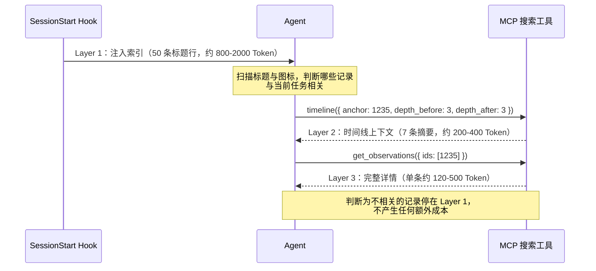

## 设计哲学：让 Agent 自己决定看什么

Progressive Disclosure（渐进式信息披露，后文均使用英文原文）是 claude-mem 区别于传统 RAG 系统的核心设计。它的核心原则：

**先展示"什么存在"和"获取成本"，让 Agent 基于当前任务自主决定获取哪些详情。**

这个设计基于一个关键认知：Agent 比系统更清楚当前任务需要什么信息。系统无法准确预判"这次会话用户想做什么"，但 Agent 在看到索引后可以立即判断"哪些历史记录与当前 prompt 相关"。

传统 RAG 和 Progressive Disclosure 的对比：

```
传统 RAG：
  系统 → [猜测哪些相关] → 全量注入 → Agent 被迫消化
  缺陷：系统猜错了怎么办？Agent 的 Token 预算已经被占用

Progressive Disclosure：
  系统 → [展示索引] → Agent → [自主判断相关性] → 按需获取
  优势：Agent 知道当前任务，做出的相关性判断远比系统准确
```

## 三层工作流：Index → Context → Details

三层的协作方式如图 8-1 所示：系统只在会话开始时推送一次轻量索引，之后的每一步都由 Agent 主动发起，Token 成本逐层递增、按需支付。



图 8-1：Index → Context → Details 三层渐进披露的数据流。系统只推送一次索引（每条约 20-30 Token），Context 和 Details 由 Agent 按需拉取，每深入一层，单条记录的 Token 成本上升一个量级。

### Layer 1：Index（搜索索引）

SessionStart Hook 注入的是一张"目录"，约 800-2000 Token：

```markdown
### May 4, 2026

**General**
| ID | Time | T | Title | Tokens |
|----|------|---|-------|--------|
| #1234 | 2:15 PM | ⚖️ | 选用 pgvector 做向量搜索 | ~180 |
| #1235 | 2:30 PM | 🔴 | 修复连接池泄漏 | ~120 |
| #1236 | 3:00 PM | 🔵 | Worker 端口计算逻辑 | ~95 |

**src/services/auth.ts**
| ID | Time | T | Title | Tokens |
|----|------|---|-------|--------|
| #1237 | 3:15 PM | ✅ | JWT 验证改为异步 | ~155 |
```

每条记录约占 20-30 Token（ID + 时间 + 图标 + 标题 + Token 数，中文标题比英文消耗更多 Token），50 条记录总共约 1,000-1,500 Token。

### Layer 2：Context（时间线上下文）

Agent 看到某条记录感兴趣时，可以先获取时间线上下文——理解这条 Observation 前后发生了什么：

```typescript
timeline({ anchor: 1235, depth_before: 3, depth_after: 3 })
```

返回以 #1235 为中心的 7 条 Observation 的标题和摘要，帮助 Agent 理解因果链。

### Layer 3：Details（完整详情）

确认需要深入了解后，获取完整 Observation：

```typescript
get_observations({ ids: [1235] })
```

返回完整的 narrative、facts、files 信息，约 120 Token。

三层总成本：~1,200（索引）+ 0（未使用 timeline）+ 120（1 条详情）= ~1,320 Token。如果是传统 RAG 注入同样 50 条的完整内容，成本约 7,500 Token——节省约 80%。

## Token 成本可见化

索引表的最后一列是 `Tokens`，展示获取该条完整内容的预估成本：

```
| #1234 | 2:15 PM | ⚖️ | 选用 pgvector 做向量搜索 | ~180 |
                                                      ^^^^
                                                   "这条详情约 180 Token"
```

为什么要显示这个数字？

1. **预算意识**：Agent 可以评估"花 180 Token 获取这条信息是否值得"
2. **规模感知**：~50 Token 的记录是简短事实，~500 Token 的记录是详细分析
3. **批量决策**：获取 5 条 ~100 Token 的记录（500 Token）比 1 条 ~500 Token 的记录更分散风险

使用 `~` 前缀表示这是近似值（基于文本长度估算），不是精确 Token 计数。精确计数需要调用 tokenizer，在索引生成阶段不值得付出这个性能成本。

## 语义压缩：好标题的 10 个字原则

索引的有效性完全取决于标题质量。一个好标题需要在约 10 个字内传达足够的信息：

**差标题**：`修复了一个问题`
- Agent 无法判断是否与当前任务相关
- 必须 fetch 详情才能做决策
- 浪费了索引层的筛选价值

**好标题**：`修复连接池泄漏导致的 5xx`
- Agent 立即知道：这是一个关于连接池的 bug fix
- 如果当前任务与连接池无关，可以跳过
- 如果相关，知道问题是"泄漏"且表现为"5xx"

好标题的特征：
- **具体**：包含具体的技术术语（`pgvector`、`JWT`、`WAL`）
- **因果**：暗示问题和解决方案的关系
- **自足**：不依赖上下文就能理解大意
- **可搜索**：包含 Agent 可能查找的关键词

claude-mem 的 AI 压缩 Prompt 中有明确的标题生成指导，确保 SDK Agent 产出符合这些标准的标题。

## 图标分类系统的认知负载优化

索引表的 `T` 列是 Observation 的类型图标。这里要先分清两个容易混淆的维度：**type**（类型）和 **concept**（概念标签）。type 有图标，出现在索引表中；concept 没有图标，只作为检索时的过滤条件。

Type 到图标的映射定义在 `src/cli/claude-md-commands.ts` 的 `TYPE_ICONS` 常量中：

| Type | 图标 | 含义 |
|------|------|------|
| bugfix | 🔴 | Bug 修复 |
| feature | 🟣 | 新功能 |
| refactor | 🔄 | 重构 |
| change | ✅ | 代码/配置变更 |
| discovery | 🔵 | 学习或洞察 |
| decision | ⚖️ | 架构决策 |
| session | 🎯 | 会话摘要 |
| prompt | 💬 | 用户原始请求 |

未知类型统一回退到 📝（`getTypeIcon` 函数）。

Concept 标签描述的是内容的知识形态，是与 type 正交的独立维度，共 7 个：how-it-works、why-it-exists、what-changed、problem-solution、gotcha、pattern、trade-off。它们不显示在索引表中，用途是检索过滤——`SearchManager` 通过 `sessionSearch.findByConcept()` 按 concept 查找 Observation，对应 HTTP 路由 `/search/by-concept`。一条 Observation 有一个 type 和若干 concept：比如"修复连接池泄漏"的 type 是 bugfix（索引中显示 🔴），concept 可能同时打上 problem-solution 和 gotcha。

图标系统的设计考量：

**视觉扫描**：彩色图标比文本标签更容易被视觉系统捕获，无论是人类还是 LLM。

**优先级信号**：🔴 bugfix 和 ⚖️ decision 最需要被关注（前者标记已修复的问题，后者避免做出冲突决策），🔵 discovery 优先级较低（知识性内容，需要时再查）。

**Token 效率**：1 个 emoji 通常只占 1-2 个 Token——不同 tokenizer 对 emoji 的编码方式不同，这个数字是量级示意而非精确值——而 "problem-solution" 这样的文本标签要 2-3 个 Token。在 50 条索引中能节省几十个 Token。

**模式识别**：Agent 看到连续多个 🔴 时可以推断"那段时间在密集修 Bug"，看到 ⚖️ 集中出现可以推断"那是一次架构决策会议"。

## 对比传统 RAG 的效率差异

以一个真实场景举例：Agent 被要求"修复 auth 模块的一个 Bug"，系统中有 50 条历史 Observation。

### 传统 RAG

```
1. 将 "fix auth bug" 做 embedding
2. 向量检索 Top-10 相关 observation
3. 注入 10 条完整内容：~1,500 Token × 10 = 15,000 Token
4. 其中真正相关的：2 条（命中率 20%）
5. 有效 Token：3,000 / 15,000 = 20%
```

### Progressive Disclosure

```
1. SessionStart 注入 50 条索引：~750 Token
2. Agent 扫描标题，发现 2 条与 auth 相关
3. fetch 2 条详情：~300 Token
4. 总消耗：750 + 300 = 1,050 Token
5. 有效 Token：300 / 1,050 = 28%（详情部分 100%）
```

Token 节省：15,000 → 1,050（节省 93%）。

但更重要的差异不在 Token 数量，而在**相关性准确率**：
- RAG 的命中率取决于 Embedding 质量和 Query 的表达
- Progressive Disclosure 的命中率取决于 Agent 的判断力——而 Agent 正在处理用户的实际 prompt，它对"什么是相关的"有最准确的认知

---

**思考题**

1. Progressive Disclosure 依赖 Agent 的"主动搜索意识"——如果 Agent 看了索引但没 fetch 任何记录（可能是懒，也可能是判断无关），系统有什么 fallback？提示：想想 `__IMPORTANT` 工具的作用。
2. 索引中展示的 Token 估算值（如 ~155）是怎么计算的？如果你来实现，会用 tiktoken 精确计算还是字符数近似？考虑性能代价。
3. 如果一个项目有 5000 条 Observation，索引不可能全部展示。你会怎么设计"索引的索引"？claude-mem 的做法是按时间截断（最近 50 条），还有更好的方案吗？

---

下一章将分析 MCP 搜索架构——Progressive Disclosure 的工具层实现。

> 本书开源发布于 [inferloop.dev](https://inferloop.dev)，转载请注明出处。

---

> 本章来自《Agent Memory 工程实战》开源版 · 作者「递归客」  
> 在线阅读完整书系：[inferloop.dev](https://inferloop.dev)  
> 源码仓库：[github.com/diguike/book-claude-mem](https://github.com/diguike/book-claude-mem)
