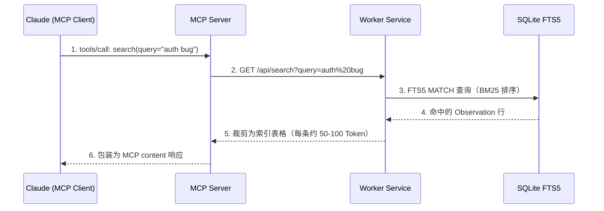

## MCP (Model Context Protocol) 入门

MCP 是 Anthropic 定义的开放协议，用于标准化 LLM 与外部工具/数据源之间的通信。对 claude-mem 来说，MCP 是 Claude Code 与记忆搜索系统之间的桥梁。

通信模型：

```
Claude Code (MCP Client)
    ↕ JSON-RPC over stdio
MCP Server (plugin/scripts/mcp-server.cjs)
    ↕ HTTP
Worker Service (Express API)
    ↕ SQL
SQLite / ChromaDB
```

MCP Server 是一个独立进程，由 Claude Code 启动和管理。它的职责是将 MCP 协议的工具调用翻译为对 Worker HTTP API 的请求。

一次搜索调用的完整流程：

```
1. Claude 决定调用 search 工具
2. Claude Code 向 MCP Server 发送 JSON-RPC 请求：
   {"method":"tools/call","params":{"name":"search","arguments":{"query":"auth bug"}}}
3. MCP Server 将其转换为 HTTP 请求：
   GET http://localhost:37700/api/search?query=auth%20bug
4. Worker 执行 FTS5 查询，返回结果
5. MCP Server 将 HTTP 响应包装为 MCP 响应：
   {"content":[{"type":"text","text":"| ID | Time | Title |..."}]}
6. Claude Code 将结果呈现给 Claude
7. Claude 基于结果决定下一步
```

这条链路如图 9-1 所示：



图 9-1：一次 search 工具调用的完整链路。MCP Server 不做任何数据处理，只负责协议翻译；结果裁剪发生在 Worker 侧，返回给 Claude 的是轻量索引而非全文。

## 从 9 个工具到 4 个核心搜索工具的演进

claude-mem 的 MCP 搜索工具经历了一次重要的精简：

### v5.x 时代：9 个搜索工具

```
search_observations  — 全文搜索
find_by_type        — 按类型过滤
find_by_file        — 按文件过滤
find_by_concept     — 按概念过滤
get_recent_context  — 最近会话
get_observation     — 获取单条
get_session         — 获取会话
get_prompt          — 获取 prompt
help                — API 文档
```

问题：
- 工具间功能重叠（search_observations 和 find_by_type 可以合并）
- 每个工具都有复杂的参数 Schema，总共约 2,500 Token 的工具定义
- Claude 经常不知道该用哪个工具
- 没有引导正确工作流的机制

### v12.x：4 个核心搜索工具

```
__IMPORTANT         — 工作流说明（始终可见）
search              — 搜索索引（接受所有参数）
timeline            — 时间线上下文
get_observations    — 批量获取详情
```

改进效果：
- 代码从 ~2,718 行缩减为 ~312 行（88% reduction）
- 工具定义 Token 消耗大幅降低
- 工作流不言自明：search → timeline → get_observations
- `additionalProperties: true` 让参数 Schema 极简

### 4 个之外：MCP Server 上的另外两个工具族

需要说明的是，"4 个"指的是核心搜索工具。截至 v12.6.2，`src/servers/mcp-server.ts` 实际注册了 13 个工具，除上述 4 个之外还有两个独立的工具族：

- **smart-explore 代码导航工具族（3 个）**：`smart_search`、`smart_unfold`、`smart_outline`。它们面向代码库的结构化探索（搜索符号、按需展开代码块、查看文件大纲），与记忆搜索是两条不同的数据链路
- **Knowledge Agent corpus 工具族（6 个）**：`build_corpus`、`list_corpora`、`prime_corpus`、`query_corpus`、`rebuild_corpus`、`reprime_corpus`。它们用于从文档集合构建可查询的知识库，第 11 章展开分析

本章聚焦 4 个核心搜索工具，因为它们承载了记忆检索的主流程，也是"9 → 4"精简这场设计演进的主角。

## `__IMPORTANT` 工具：用工具定义引导行为

这是 claude-mem MCP 设计中最有创意的部分。`__IMPORTANT` 不是一个真正的"工具"，它是一段伪装成工具描述的行为指导：

```typescript
{
  name: '__IMPORTANT',
  description: `3-LAYER WORKFLOW (ALWAYS FOLLOW):
1. search(query) → Get index with IDs (~50-100 tokens/result)
2. timeline(anchor=ID) → Get context around interesting results
3. get_observations([IDs]) → Fetch full details ONLY for filtered IDs
NEVER fetch full details without filtering first. 10x token savings.`,
  inputSchema: { type: 'object', properties: {} }
}
```

为什么这样做？

Claude Code 的 MCP Client 在会话中会展示所有已注册工具的描述。`__IMPORTANT` 的双下划线前缀使其排列在工具列表最前面。Claude 在查看工具列表时，第一个看到的就是这条"工作流指南"。

这比在 System Prompt 中写"使用记忆搜索时请遵循 3 层工作流"更有效，因为：
- 它出现在工具使用的上下文中（proximity principle）
- 它不占用 System Prompt 的宝贵空间
- 它会在 Claude 考虑使用搜索工具时自然被看到

## search → timeline → get_observations 三步曲

### search：第一步，获取索引

```typescript
// MCP Server 中的 search handler
{
  name: 'search',
  description: 'Step 1: Search memory. Returns index with IDs.',
  inputSchema: {
    type: 'object',
    properties: {},
    additionalProperties: true  // 接受任意参数
  },
  handler: async (args) => {
    const params = new URLSearchParams();
    for (const [key, value] of Object.entries(args)) {
      params.append(key, String(value));
    }
    const response = await fetch(`http://localhost:${port}/api/search?${params}`);
    return await response.json();
  }
}
```

支持的参数（透传给 Worker API）：
- `query`：全文搜索词
- `type`：Observation 类型过滤
- `project`：项目名过滤
- `dateStart` / `dateEnd`：日期范围
- `limit`：返回数量（默认 20）
- `offset`：分页偏移

为什么用 `additionalProperties: true`？

精确的 Schema 会消耗 Token（每个属性的 type、description 都是 Token）。对于一个参数全部可选的搜索 API，不如让 Schema 保持开放，通过 `__IMPORTANT` 的描述来引导正确使用。

### timeline：第二步，获取上下文

```typescript
{
  name: 'timeline',
  description: 'Step 2: Get context around results. Params: anchor OR query, depth_before, depth_after',
  handler: async (args) => {
    const params = new URLSearchParams();
    for (const [key, value] of Object.entries(args)) {
      params.append(key, String(value));
    }
    return await fetch(`http://localhost:${port}/api/timeline?${params}`).then(r => r.json());
  }
}
```

timeline 以某条 Observation 为锚点，展示其前后的时间线。这帮助 Agent 理解因果关系："为什么做了这个决策？之后发生了什么？"

### get_observations：第三步，获取详情

```typescript
{
  name: 'get_observations',
  description: 'Step 3: Fetch full details for filtered IDs.',
  inputSchema: {
    type: 'object',
    properties: {
      ids: {
        type: 'array',
        items: { type: 'number' },
        description: 'Array of observation IDs to fetch (required)'
      }
    },
    required: ['ids'],
    additionalProperties: true
  },
  handler: async (args) => {
    return await fetch(`http://localhost:${port}/api/observations/batch`, {
      method: 'POST',
      headers: { 'Content-Type': 'application/json' },
      body: JSON.stringify(args)
    }).then(r => r.json());
  }
}
```

这是唯一一个有 `required` 参数的工具——必须提供 `ids` 数组。这在结构上强制了"先搜索得到 ID，再用 ID 获取详情"的流程。

## MCP Server 实现：协议翻译层的极简设计

MCP Server 的完整实现只有约 312 行代码（`plugin/scripts/mcp-server.cjs`，源码用 TypeScript 编写后编译为 CJS 格式分发）。以下用 ESM 语法展示核心逻辑：

```typescript
// 以下为源码逻辑的 ESM 表示（实际分发为编译后的 .cjs 文件）
import { Server } from '@modelcontextprotocol/sdk/server/index.js';
import { StdioServerTransport } from '@modelcontextprotocol/sdk/server/stdio.js';

const server = new Server({ name: 'claude-mem-search', version: '1.0.0' });

// 注册工具列表（此处只展示 4 个核心搜索工具，
// 完整列表还包括 smart-explore 和 corpus 两个工具族）
server.setRequestHandler('tools/list', async () => ({
  tools: [
    { name: '__IMPORTANT', description: '...', inputSchema: {...} },
    { name: 'search', description: '...', inputSchema: {...} },
    { name: 'timeline', description: '...', inputSchema: {...} },
    { name: 'get_observations', description: '...', inputSchema: {...} },
  ]
}));

// 处理工具调用
server.setRequestHandler('tools/call', async (request) => {
  const { name, arguments: args } = request.params;
  const handler = toolHandlers[name];
  const result = await handler(args);
  return { content: [{ type: 'text', text: formatResult(result) }] };
});

// 通过 stdio 通信
const transport = new StdioServerTransport();
await server.connect(transport);
```

关键设计决策：
- **无业务逻辑**：MCP Server 不做任何数据处理，只负责协议翻译
- **单一数据源**：所有数据来自 Worker HTTP API
- **错误透传**：Worker 返回的错误直接转发给 Claude
- **无状态**：每次调用独立，不维护会话状态

## FTS5 注入防护

全文搜索面临的安全风险：用户（或 Agent）构造恶意查询可能导致 FTS5 解析错误或意外行为。

claude-mem 的防护策略是对 FTS5 特殊字符做转义（`src/services/sqlite/SessionSearch.ts:269`）：

```typescript
// src/services/sqlite/SessionSearch.ts:269（简化）
const escapedQuery = '"' + query.replace(/"/g, '""') + '"';
```

做法是把整个查询包在双引号里当作短语字面量，并把内部的双引号翻倍。这一步挡住了几类典型问题：

- FTS5 操作符注入：`NOT`、`OR`、`AND`、`NEAR`、`*` 被当作普通文本而不是查询语法
- 引号逃逸：`"nested "quotes" here"` 无法提前闭合字符串
- 语法崩溃：未配对引号、特殊符号导致的 FTS5 解析错误

在 claude-mem 的场景中，查询来源是 Claude（通过 MCP 工具调用），不是直接的用户输入。但防护仍然必要——Claude 可能基于用户 prompt 构造查询，而用户 prompt 中可能包含特殊字符。

---

**思考题**

1. 如果要为核心搜索工具族添加第 5 个工具，你认为应该是什么功能？给出工具名、参数设计和使用场景，并论证为什么当前 4 个工具无法覆盖。
2. FTS5 查询的转义防护针对的是"文本注入"。如果攻击者通过精心构造的文件名触发 Hook，进而影响搜索索引，该如何防护？
3. 当前搜索结果的排序基于 FTS5 内置的 BM25 算法。如果要加入"时间衰减"因子（越新的 Observation 排名越高），你会怎么实现？

---

> 本书开源发布于 [inferloop.dev](https://inferloop.dev)，转载请注明出处。

下一章将分析 Observation 系统——从原始 Tool Usage 到结构化记忆单元的转换流水线。

---

> 本章来自《Agent Memory 工程实战》开源版 · 作者「递归客」  
> 在线阅读完整书系：[inferloop.dev](https://inferloop.dev)  
> 源码仓库：[github.com/diguike/book-claude-mem](https://github.com/diguike/book-claude-mem)
