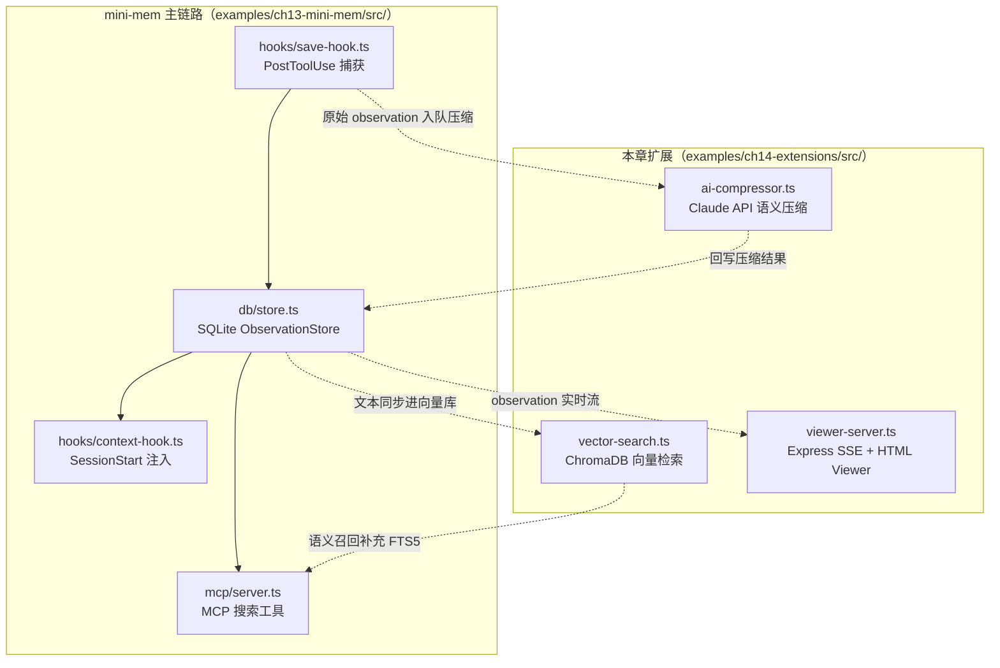

## 扩展全景

第 13 章的 mini-mem 走通了「捕获 → 存储 → 注入 / 检索」的最小闭环。本章在这条主链路上挂三个扩展：AI 压缩、向量检索和实时 Viewer。图 14-1 标出了每个扩展的挂接位置和数据通路。



图 14-1：三个扩展模块与 mini-mem 主链路的挂接关系。实线是第 13 章已有链路，虚线是本章新增的数据通路。

配套代码 `examples/ch14-extensions/src/` 下只有三个扁平文件：`ai-compressor.ts`、`vector-search.ts`、`viewer-server.ts`，各自是可独立运行的演示（对应 `npm run demo:compress` / `demo:search` / `demo:viewer`）。把它们真正接进 mini-mem 涉及代码组织和异步改造，属于设计层面的讨论。正文会明确区分两类代码块：标注了配套文件名的是可运行节选，标注「设计示意」的则留作练习。

## 添加 AI 压缩（接入 Claude API）

mini-mem 的基础版使用规则提取标题，信息密度有限。接入 Claude API 后可以实现真正的语义压缩。

### 实现思路

配套代码 `examples/ch14-extensions/src/ai-compressor.ts` 是可直接运行的压缩演示（`npm run demo:compress`），它把一批 observation 批量压缩成一段摘要。挂进 mini-mem 的主链路时，更实用的形态是按单条工具调用压缩、输出结构化 observation，下面给出这一版的设计：

```typescript
// 设计示意：单条工具调用的语义压缩，接入 mini-mem 的完整实现留作练习
// 可运行的批量压缩演示见 examples/ch14-extensions/src/ai-compressor.ts
import Anthropic from '@anthropic-ai/sdk';

const client = new Anthropic(); // 读取 ANTHROPIC_API_KEY 环境变量

export async function compressObservation(
  toolName: string,
  toolInput: Record<string, unknown>,
  toolResponse: Record<string, unknown>
): Promise<{ type: string; title: string; narrative: string; facts: string[] }> {
  const response = await client.messages.create({
    model: 'claude-haiku-4-5-20251001', // 用最新的 Haiku 模型降低成本（请替换为当前可用的模型 ID）
    max_tokens: 300,
    messages: [{
      role: 'user',
      content: `分析以下工具调用，提取一条结构化观察。

工具: ${toolName}
输入: ${JSON.stringify(toolInput).slice(0, 1000)}
输出: ${JSON.stringify(toolResponse).slice(0, 500)}

以 JSON 格式返回：
{"type": "change|bugfix|discovery|decision|how-it-works", "title": "10字以内的标题", "narrative": "50字以内的叙述", "facts": ["事实1", "事实2"]}`
    }]
  });

  const text = response.content[0].type === 'text' ? response.content[0].text : '';
  return JSON.parse(text);
}
```

### 异步化改造

AI 调用需要 5-15 秒，不能放在 Hook 同步路径中。改造方案：将 save-hook 改为入队模式，单独启动一个 Worker 处理队列。这部分在配套代码中没有对应实现，下面是设计示意——其中 `getPending`、`updateObservation`、`markProcessed` 三个方法也需要在 ch13 的 `ObservationStore` 上补充：

```typescript
// 设计示意：队列消费循环，完整实现留作练习
import { ObservationStore } from '../db/store.js';
import { compressObservation } from '../services/compressor.js';

export async function processQueue(): Promise<void> {
  const store = new ObservationStore();
  const pending = store.getPending(10); // 取最多 10 条待处理

  for (const item of pending) {
    try {
      const compressed = await compressObservation(
        item.tool_name,
        JSON.parse(item.tool_input),
        JSON.parse(item.tool_response)
      );

      store.updateObservation(item.id, compressed);
      store.markProcessed(item.id);
    } catch (error) {
      // 失败不阻塞，下次重试
      console.error(`Failed to compress #${item.id}:`, error);
    }
  }

  store.close();
}
```

Worker 用 setInterval 定时拉取队列：

```typescript
// 设计示意：Worker 入口，完整实现留作练习
import { processQueue } from './processor.js';

// 每 5 秒处理一次队列
setInterval(processQueue, 5000);
```

## 实现 Timeline 时间线视图

Timeline 提供某条 Observation 前后的上下文视图：

```typescript
// 设计示意：在 ch13-mini-mem 的 src/db/store.ts 中添加，完整实现留作练习
getTimeline(anchorId: number, before: number = 3, after: number = 3) {
  const anchor = this.db.prepare('SELECT created_at, project FROM observations WHERE id = ?').get(anchorId) as any;
  if (!anchor) return { before: [], anchor: null, after: [] };

  const beforeRows = this.db.prepare(`
    SELECT id, type, title, created_at FROM observations
    WHERE project = ? AND created_at < ? ORDER BY created_at DESC LIMIT ?
  `).all(anchor.project, anchor.created_at, before);

  const afterRows = this.db.prepare(`
    SELECT id, type, title, created_at FROM observations
    WHERE project = ? AND created_at > ? ORDER BY created_at ASC LIMIT ?
  `).all(anchor.project, anchor.created_at, after);

  return {
    before: beforeRows.reverse(),
    anchor: this.db.prepare('SELECT id, type, title, narrative, created_at FROM observations WHERE id = ?').get(anchorId),
    after: afterRows
  };
}
```

在 MCP Server 中注册 timeline 工具：

```typescript
{
  name: 'timeline',
  description: 'Get observations before/after a specific observation.',
  inputSchema: {
    type: 'object',
    properties: {
      anchor: { type: 'number', description: 'Observation ID' },
      before: { type: 'number', description: 'Count before (default 3)' },
      after: { type: 'number', description: 'Count after (default 3)' }
    },
    required: ['anchor']
  }
}
```

## 向量搜索集成

用 ChromaDB 或 Qdrant 实现语义搜索。配套代码 `examples/ch14-extensions/src/vector-search.ts` 用 ChromaDB 的 Node.js 客户端实现了写入和检索，核心部分节选如下：

```typescript
// examples/ch14-extensions/src/vector-search.ts（节选）
import { ChromaClient } from 'chromadb';

const COLLECTION_NAME = 'observations';

// 初始化 ChromaDB 客户端（连接本地实例）
const chroma = new ChromaClient({
  path: process.env.CHROMA_HOST || 'http://localhost:8000',
});

// 初始化 collection 并写入 observation 数据
async function seedObservations(observations: Observation[]) {
  // ChromaDB 默认使用内置 embedding 函数，无需额外调用 embedding API
  const collection = await chroma.getOrCreateCollection({
    name: COLLECTION_NAME,
    metadata: { description: 'User observation memory store' },
  });

  await collection.add({
    ids: observations.map((obs) => obs.id),
    documents: observations.map((obs) => obs.content),
    metadatas: observations.map((obs) => ({
      category: obs.category,
      timestamp: obs.timestamp,
    })),
  });

  return collection;
}

// 语义搜索：根据自然语言查询返回最相关的 observation
async function semanticSearch(query: string, topK: number = 3) {
  const collection = await chroma.getCollection({ name: COLLECTION_NAME });

  const results = await collection.query({
    queryTexts: [query],
    nResults: topK,
  });

  return results;
}
```

完整文件还实现了 `filteredSearch`（metadata 过滤加语义搜索，`where: { category: { $eq: category } }`），并附带一段可运行的演示数据，`npm run demo:search` 可以直接跑通。接入 mini-mem 时，在 save-hook 写入 SQLite 后同步调用一次 `collection.add`，MCP 搜索工具里将向量召回结果与 FTS5 结果合并即可。

ChromaDB 需要单独启动服务：

```bash
# 使用 Docker
docker run -p 8000:8000 chromadb/chroma

# 或用 pip
pip install chromadb
chroma run --path ./chroma-data
```

## Viewer UI：React 实时展示面板

添加一个简单的 Web UI 展示 Observation 流。配套代码 `examples/ch14-extensions/src/viewer-server.ts` 实现了完整的 SSE 服务（`npm run demo:viewer` 启动），核心部分节选如下：

```typescript
// examples/ch14-extensions/src/viewer-server.ts（节选）
import express from 'express';
import type { Request, Response } from 'express';

const app = express();
app.use(express.json());

// 内存中的 observation 存储（演示用）
const observations: Observation[] = [];
const sseClients: Set<Response> = new Set();

// SSE 端点：连接时先推全量数据，之后接收增量广播
app.get('/api/stream', (req: Request, res: Response) => {
  res.setHeader('Content-Type', 'text/event-stream');
  res.setHeader('Cache-Control', 'no-cache');
  res.setHeader('Connection', 'keep-alive');

  res.write(`data: ${JSON.stringify({ type: 'init', observations })}\n\n`);
  sseClients.add(res);

  req.on('close', () => {
    sseClients.delete(res);
  });
});

// 向所有 SSE 客户端广播新 observation
function broadcast(observation: Observation) {
  const payload = `data: ${JSON.stringify({ type: 'new', observation })}\n\n`;
  for (const client of sseClients) {
    client.write(payload);
  }
}

// 写入端点：POST 一条 observation 并广播给所有在线客户端
app.post('/api/observations', (req: Request, res: Response) => {
  const { content, category } = req.body;
  const observation: Observation = {
    id: `obs-${Date.now()}`,
    content,
    category: category || 'general',
    timestamp: new Date().toISOString(),
  };
  observations.push(observation);
  broadcast(observation);
  res.status(201).json(observation);
});
```

演示版把 observation 存在内存数组里，通过 POST 写入并实时广播。接到 mini-mem 时，把内存数组换成 `ObservationStore`，用 `store.getAfter(lastId)` 轮询 SQLite 中的新数据即可。

配套代码的前端是内嵌在 `viewer-server.ts` 里的一个纯 HTML 页面，用原生 `EventSource` 消费 SSE，浏览器打开服务地址就能看到实时刷新的 observation 列表。如果想换成 React，消费组件的骨架如下：

```tsx
// 设计示意：React 版消费组件，完整实现留作练习
// 配套代码的可运行版本是 viewer-server.ts 内嵌的原生 HTML 页面
function ObservationFeed() {
  const [observations, setObservations] = useState<Observation[]>([]);

  useEffect(() => {
    const es = new EventSource('/api/stream');
    es.onmessage = (event) => {
      const obs = JSON.parse(event.data);
      setObservations(prev => [obs, ...prev].slice(0, 100));
    };
    return () => es.close();
  }, []);

  return (
    <div className="feed">
      {observations.map(obs => (
        <div key={obs.id} className="observation-card">
          <span className="type">{obs.type}</span>
          <h3>{obs.title}</h3>
          <p>{obs.narrative}</p>
        </div>
      ))}
    </div>
  );
}
```

## 多项目隔离与切换

支持同时追踪多个项目的记忆，在 Context Injection 时只注入当前项目相关的内容。ch13 的 `src/hooks/context-hook.ts` 里项目识别只取 `cwd` 的最后一段目录名（`input.cwd.split('/').pop()`），可以升级成三级回退策略：

```typescript
// 设计示意：升级 ch13-mini-mem src/hooks/context-hook.ts 的项目识别，完整实现留作练习
function getProjectName(cwd: string): string {
  // 策略 1：如果有 package.json，用其 name 字段
  const pkgPath = path.join(cwd, 'package.json');
  if (existsSync(pkgPath)) {
    const pkg = JSON.parse(readFileSync(pkgPath, 'utf-8'));
    if (pkg.name) return pkg.name;
  }

  // 策略 2：用 git 仓库根目录名
  try {
    const gitRoot = execSync('git rev-parse --show-toplevel', { cwd }).toString().trim();
    return path.basename(gitRoot);
  } catch {}

  // 策略 3：用当前目录名
  return path.basename(cwd);
}
```

查询时自动按项目过滤：

```sql
SELECT * FROM observations WHERE project = ? ORDER BY created_at DESC LIMIT ?
```

---

**思考题**

1. AI 压缩每条 Observation 的成本约 $0.001（基于 Claude Haiku）。如果一天产生 200 条 Observation，一年的压缩成本是多少？如何在质量和成本之间取舍（比如只压缩超过一定长度的 Observation）？
2. 向量搜索和 FTS5 全文搜索各有优劣。设计一个混合排序策略：什么情况下优先用向量搜索，什么情况下优先用 FTS5？
3. 多项目支持中，项目识别依赖 package.json name 和 git 仓库名。如果用户在 monorepo 中工作（多个子项目共享一个 git root），如何正确识别当前子项目？

---

> 本书开源发布于 [inferloop.dev](https://inferloop.dev)，转载请注明出处。

至此，mini-mem 的四条扩展路径都已经走通：AI 压缩、向量搜索、实时 UI 各有可独立运行的演示（`examples/ch14-extensions/`），异步 Worker 和多项目识别给出了落地设计。下一部分将讨论如何将这类系统从个人工具升级到企业级平台。

---

> 本章来自《Agent Memory 工程实战》开源版 · 作者「递归客」  
> 在线阅读完整书系：[inferloop.dev](https://inferloop.dev)  
> 源码仓库：[github.com/diguike/book-claude-mem](https://github.com/diguike/book-claude-mem)
