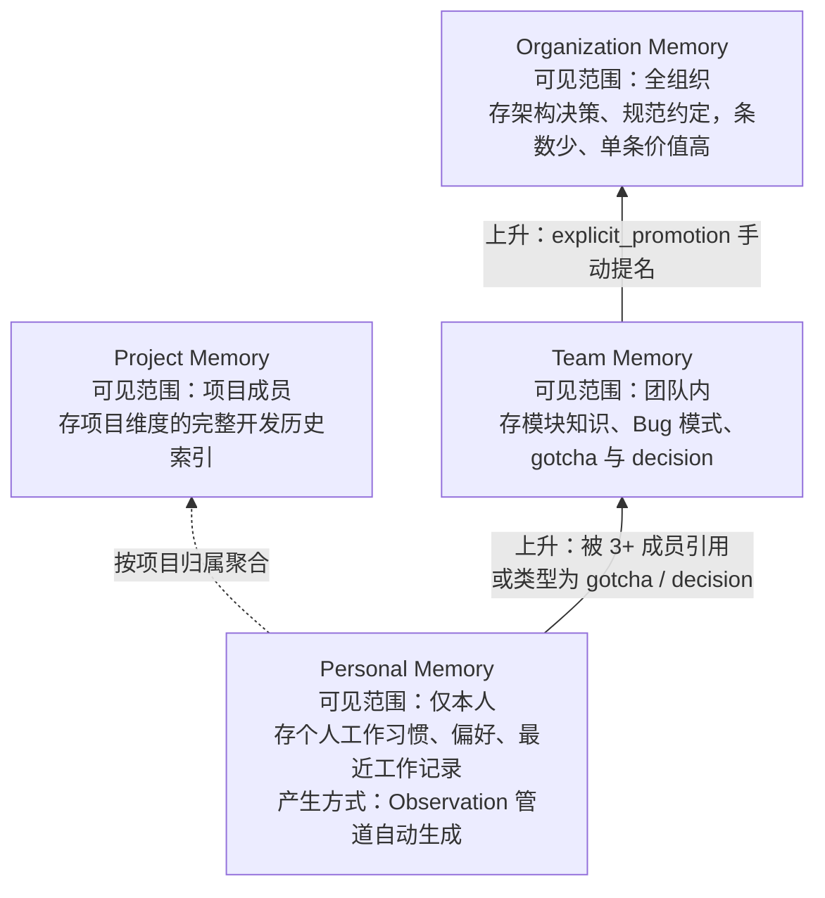
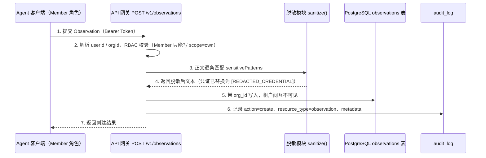

## 团队知识共享：Shared Memory Space

个人记忆解决的是"我之前做了什么"。团队记忆解决的是"团队积累了什么知识"。

### 记忆分层模型

四层记忆的职责划分和知识流动方向如图 17-1 所示：越往上共享范围越大、内容越精炼，下层记忆通过"上升"机制沉淀到上层（规则见下文）。



*图 17-1：四层记忆分层模型与知识上升方向*

每层的 Context Injection 策略不同：
- **Organization Memory**：始终注入（Token 开销小，通常是规范性声明）
- **Team Memory**：按项目关联注入
- **Project Memory**：当前项目的完整索引
- **Personal Memory**：个人偏好 + 最近工作记录

### 知识"上升"机制

个人的 Observation 在特定条件下可以"上升"为团队/组织级知识：

```typescript
// 知识提升规则
interface PromotionRule {
  condition: 'multiple_references' | 'explicit_promotion' | 'critical_type';
  threshold?: number;
  targetLevel: 'team' | 'organization';
}

// 示例规则
const rules: PromotionRule[] = [
  // 同一条 Observation 被 3 个以上团队成员 fetch 过 → 提升为 Team Memory
  { condition: 'multiple_references', threshold: 3, targetLevel: 'team' },
  // 类型为 gotcha 或 decision → 自动提升为 Team Memory
  { condition: 'critical_type', targetLevel: 'team' },
  // 手动标记
  { condition: 'explicit_promotion', targetLevel: 'organization' },
];
```

## 权限模型

### RBAC 设计

```sql
-- 角色定义
CREATE TABLE roles (
  id SERIAL PRIMARY KEY,
  name TEXT NOT NULL,           -- admin / member / viewer
  org_id INTEGER REFERENCES organizations(id)
);

-- 权限定义
CREATE TABLE permissions (
  id SERIAL PRIMARY KEY,
  role_id INTEGER REFERENCES roles(id),
  resource TEXT NOT NULL,       -- observations / teams / settings
  action TEXT NOT NULL,         -- read / write / delete / admin
  scope TEXT DEFAULT 'own'     -- own / team / org
);

-- 用户-角色关联
CREATE TABLE user_roles (
  user_id INTEGER REFERENCES users(id),
  role_id INTEGER REFERENCES roles(id),
  team_id INTEGER REFERENCES teams(id),
  PRIMARY KEY (user_id, role_id, team_id)
);
```

### 权限场景

| 角色 | 个人记忆 | 团队记忆 | 组织记忆 |
|------|---------|---------|---------|
| Member | 读写自己的 | 读 + 贡献 | 只读 |
| Team Lead | 读写自己的 | 读写 + 管理 | 只读 + 提名 |
| Admin | 读写所有 | 读写所有 | 读写所有 |

"贡献"指将个人记忆标记为团队共享，但不能修改他人的记忆。

## 数据治理

### 保留策略

不是所有记忆都应该永久保存。企业需要数据生命周期管理：

```typescript
interface RetentionPolicy {
  level: 'personal' | 'team' | 'organization';
  maxAge: number;            // 天数
  exceptions: string[];      // 保留的 type（如 decision 永久保留）
  archiveStrategy: 'delete' | 'compress' | 'archive';
}

const defaultPolicies: RetentionPolicy[] = [
  { level: 'personal', maxAge: 90, exceptions: ['decision', 'gotcha'], archiveStrategy: 'delete' },
  { level: 'team', maxAge: 365, exceptions: ['decision'], archiveStrategy: 'archive' },
  { level: 'organization', maxAge: -1, exceptions: [], archiveStrategy: 'compress' }, // 永久保留
];
```

### 数据脱敏

敏感信息（API Key、密码、内部 URL）在存储前自动检测和脱敏：

```typescript
// 脱敏规则
const sensitivePatterns = [
  { pattern: /(?:api[_-]?key|secret|password|token)\s*[=:]\s*['"]?([^\s'"]+)/gi, replacement: '[REDACTED_CREDENTIAL]' },
  { pattern: /\b[A-Za-z0-9+/]{40,}\b/g, replacement: '[REDACTED_KEY]' },
  { pattern: /https?:\/\/[^\/]*internal\.[^\/]*/g, replacement: '[INTERNAL_URL]' },
];

export function sanitize(text: string): string {
  let result = text;
  for (const { pattern, replacement } of sensitivePatterns) {
    result = result.replace(pattern, replacement);
  }
  return result;
}
```

### 审计日志

所有对记忆的访问和修改操作记入审计表：

```sql
CREATE TABLE audit_log (
  id BIGSERIAL PRIMARY KEY,
  user_id INTEGER NOT NULL,
  action TEXT NOT NULL,         -- create / read / update / delete / search / export
  resource_type TEXT NOT NULL,  -- observation / corpus / team_memory
  resource_id INTEGER,
  metadata JSONB,              -- 补充信息（查询内容、修改前后等）
  ip_address INET,
  created_at TIMESTAMPTZ DEFAULT NOW()
);

-- 按时间分区，便于定期归档
CREATE INDEX audit_log_time_idx ON audit_log (created_at);
CREATE INDEX audit_log_user_idx ON audit_log (user_id, created_at);
```

权限校验、脱敏、审计不是三个孤立的功能，它们串在同一条写入链路上。如图 17-2 所示，一次记忆写入从客户端提交到最终落库，要依次通过认证、RBAC 校验、脱敏、租户隔离写入、审计记录五道关卡，任何一道不通过都会中断请求：



*图 17-2：一次带脱敏与审计的记忆写入链路*

## Analytics Dashboard

### 核心指标

| 指标 | 计算方式 | 业务含义 |
|------|---------|---------|
| Memory Utilization Rate | 被 fetch 的 Observation / 总 Observation | 记忆的实际使用率 |
| Context Hit Rate | 有 fetch 行为的会话 / 总会话 | 上下文注入的有效性 |
| Time-to-Context | 首次 search 到 get_observations 的时间间隔 | 信息检索效率 |
| Knowledge Freshness | 最近 30 天生成的 Observation 占搜索结果比例 | 知识库更新频率 |
| Team Contribution Rate | 个人记忆被提升为团队记忆的比例 | 团队知识沉淀率 |

### Dashboard 实现

```typescript
// API 端点示例
app.get('/api/analytics/overview', authMiddleware, async (req, res) => {
  const { orgId } = req;
  const period = req.query.period || '30d';

  const stats = await db.query(`
    SELECT
      COUNT(*) as total_observations,
      COUNT(DISTINCT session_id) as total_sessions,
      COUNT(CASE WHEN created_at > NOW() - INTERVAL '7 days' THEN 1 END) as recent_observations,
      (SELECT COUNT(*) FROM observation_feedback WHERE signal_type = 'fetched'
       AND created_at > NOW() - INTERVAL $1::interval) as total_fetches
    FROM observations
    WHERE org_id = $2
  `, [period, orgId]);

  res.json(stats.rows[0]);
});
```

## API 网关：Memory-as-a-Service

对外暴露统一的 REST/gRPC API，让任何 Agent 系统都能接入：

```yaml
# OpenAPI 3.0 核心端点
paths:
  /v1/observations:
    post:
      summary: 提交工具观察
      security: [bearerAuth: []]
    get:
      summary: 搜索观察
      parameters:
        - name: query
        - name: project
        - name: type
        - name: limit

  /v1/context:
    get:
      summary: 获取注入上下文
      parameters:
        - name: project
        - name: format (progressive_disclosure | full | summary)

  /v1/corpus:
    post:
      summary: 构建知识库
    get:
      summary: 查询知识库

  /v1/teams/{teamId}/memory:
    get:
      summary: 获取团队记忆
```

Rate Limiting 策略：
- 免费层：100 observations/天, 50 searches/小时
- 团队版：10,000 observations/天, 不限搜索
- 企业版：无限制 + SLA 保证

---

**思考题**

1. 团队记忆的"上升"机制（个人 Observation 被提升为团队级知识）如何防止低质量记忆污染组织级知识库？设计一个质量评估和审批流程。
2. Rate Limiting 策略中，免费层限制 100 observations/天。如果用户通过频繁创建新 session 来绕过限制（每个 session 重新计数），如何防护？
3. 企业客户要求数据驻留在特定区域（如中国大陆）。这对 API 架构、向量数据库选型和 AI 模型调用分别有什么影响？

---

> 本书开源发布于 [inferloop.dev](https://inferloop.dev)，转载请注明出处。

下一章将探讨 Agent Memory 的前沿方向：记忆互操作性、Agent 间协作、记忆遗忘和多模态记忆。

---

> 本章来自《Agent Memory 工程实战》开源版 · 作者「递归客」  
> 在线阅读完整书系：[inferloop.dev](https://inferloop.dev)  
> 源码仓库：[github.com/diguike/book-claude-mem](https://github.com/diguike/book-claude-mem)
